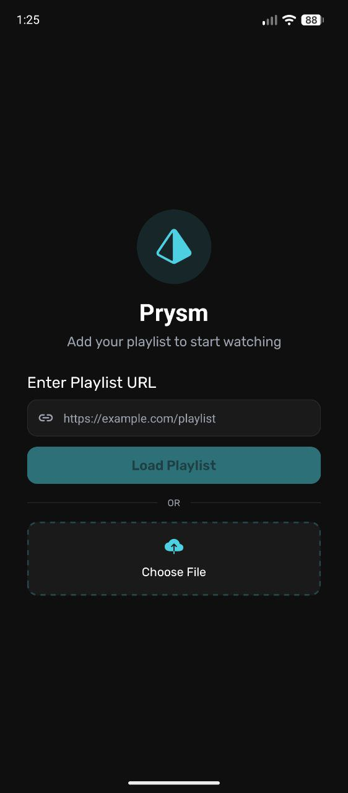
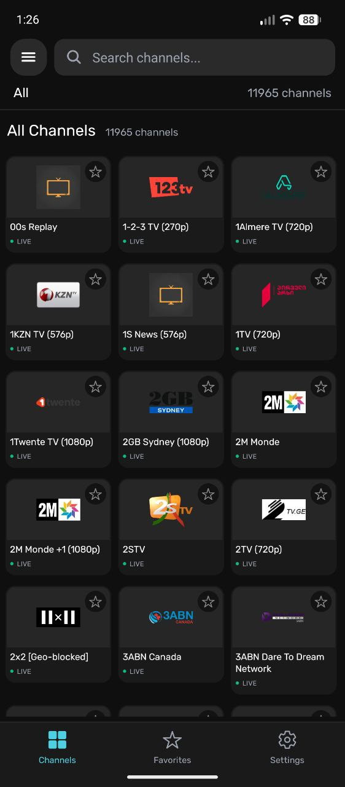
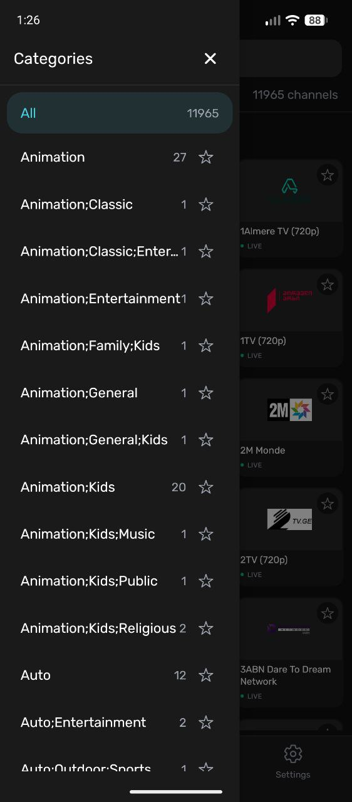
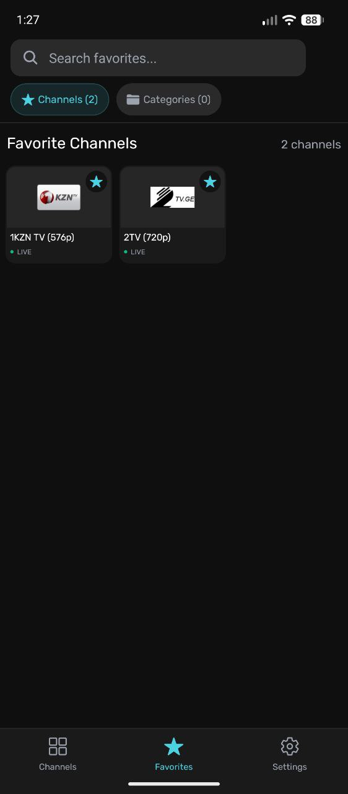
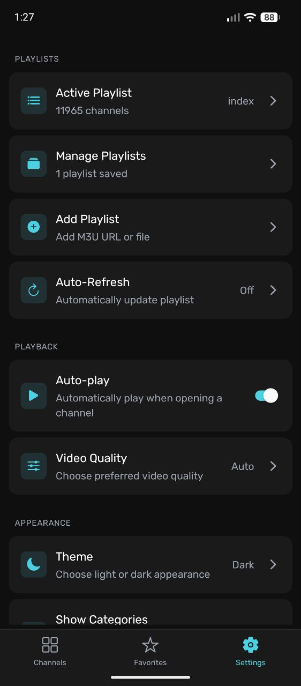
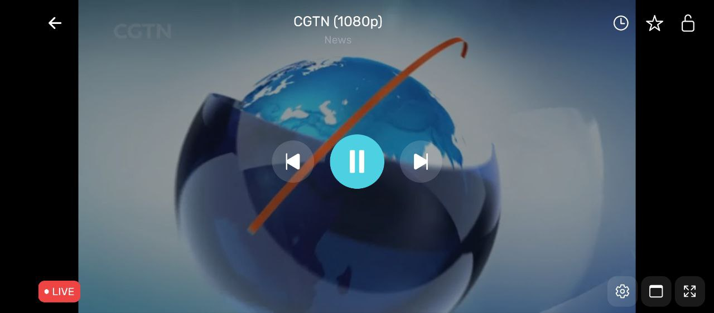
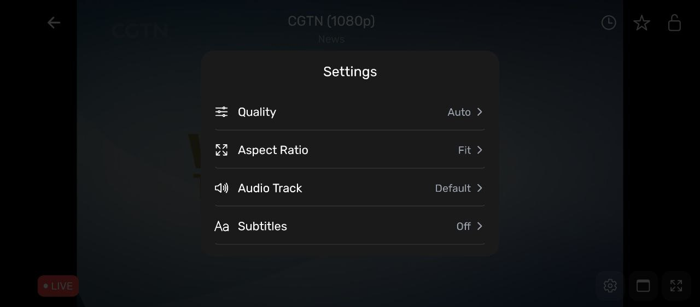

# 📺 OpenTv


OpenTv is a modern, lightweight **M3U IPTV player** built with **Expo / React Native** for **Android and Android TV**.

It is designed for large playlists, fast channel browsing, smooth playback, and a clean TV-friendly experience.

### ⚽ World Cup Channels
We have extracted **1091+ World Cup IPTV channels** with logos and stream URLs! 
👉 **[View the full World Cup Channel List here!](./worldcup/README.md)**

---

## ✨ Features

- **M3U / M3U8** playlist support.
- **Adaptive Streaming:** DASH (MPD), Smooth Streaming (MSS/ISM), and HLS with quality selection.
- **Flexible Loading:** Load playlists from a URL or a local file.
- **Fast Channel Browsing:** Optimized specifically to handle large playlists.
- **Organization:** Channel categories and filtering.
- **Search & Favorites:** Quickly find and save the channels you love.
- **Persistent Storage:** Saves your playlists automatically.
- **Auto-Refresh:** Keeps your playlist data up to date.
- **Advanced Video Playback Controls:**
  - Quality selection
  - Aspect ratio adjustments
  - Audio track selection
  - Subtitle support
- **Network Stream Player:** Play any stream directly with custom HTTP headers (Cookie, Referer, Origin), User-Agent presets, and DRM support (Widevine, PlayReady, ClearKey).
- **TV Optimized:** Full Android TV remote and D-pad navigation support.
- **UI:** Sleek, modern Dark Mode interface.

---

## 📱 Screenshots

<p align="center">
  
  
  
  
  
</p>

<p align="center">
  
  
</p>

---

## 🎯 Supported Platforms

- ✅ **Android**
- ✅ **Android TV**

_Note: iOS and Web are not primary targets for this project._

---

## 💡 Why OpenTv?

- Handles **very large playlists** (10k+ channels) smoothly without lagging.
- Built specifically with the **Android TV experience** in mind from day one.
- Uses a lightweight **Expo architecture** for easy building and deployment.
- Clean, maintainable **TypeScript** codebase.
- **100% Open Source.**

---

## 🚀 Getting Started

### 📋 Requirements

- **Node.js** 18 or higher
- **Android Studio** (for emulator testing or deploying to a physical device)

### 📦 Installation

1. Clone the repository and navigate into the directory:

   ```bash
   git clone https://github.com/ExWhyZed9/opentv.git
   cd opentv
   ```

2. Install dependencies:
   ```bash
   npm install
   ```

### ▶️ Run the App

Start the Expo development server:

```bash
npm start
```

Or, run directly on Android:

```bash
npm run android
```

---

## 🛠️ Tech Stack

- **Framework:** Expo SDK 54 / React Native
- **Language:** TypeScript
- **Navigation:** React Navigation
- **Lists:** FlashList (for high-performance rendering)
- **Media:** Expo Video
- **Storage:** AsyncStorage

---

## 🤝 Contributing

Contributions are always welcome!

1. Fork the repository.
2. Create a feature branch (`git checkout -b feature/AmazingFeature`).
3. Commit your changes.
4. Open a pull request.

**Note:** For major changes or refactors, please open an issue first to discuss what you would like to change.

---

## ⚠️ Disclaimer

**OpenTv is a media player only.** It does not provide, host, or distribute any content, streams, or playlists. Users must supply their own legally obtained IPTV sources.

---

## 📄 License

This project is licensed under the MIT License.

---

## 💬 Support

If you find OpenTv useful, consider giving it a ⭐ on GitHub!

## Build APK

```bash
cd android && ./gradlew assembleRelease
```

## download

https://expo.dev/artifacts/eas/A3KHOTmiRU4Cy2LzkIbQ1dgjbezF8szbFzJRFjXwp-A.apk


# update 
eas build --platform android --profile preview

https://expo.dev/artifacts/eas/PQWC_EbKpvXUsj9QToW-XIE-yaaPaJfAZJeLfJu4Y0k.apkß