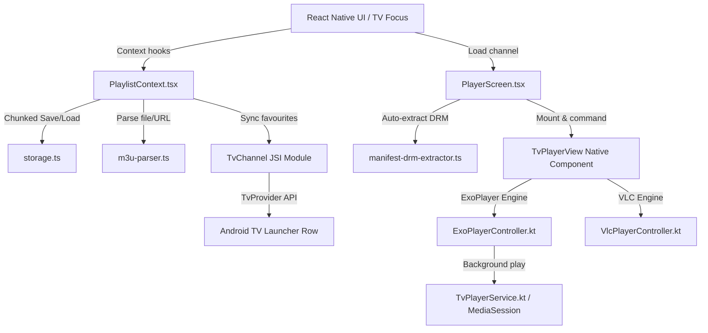

# OpenTv Codebase Architecture & Workflow Analysis

This document provides a comprehensive analysis of the **OpenTv** codebase. It covers the system architecture, file structure, application lifecycle, business logic workflow, and native integration details (IPTV player and Android TV launcher).

---

## 🗺️ Architectural Overview

OpenTv is built using a **React Native (Expo)** frontend that manages state, user settings, database storage, and user interfaces, coupled with **Custom Native Modules** written in Kotlin to handle low-level operations (ExoPlayer/VLC streaming, DRM decryption, background audio services, and Android TV integration).



---

## 📁 Key Directories & File Roles

### 1. React Native Application (`client/`)
- [App.tsx](file:///Users/ssjoy/react%20native/OnlineTv/OpenTV/client/App.tsx): App entry point. Hydrates React contexts, configures deep linking (`opentvplayer://`), and enforces landscape orientation for TV devices.
- [types/playlist.ts](file:///Users/ssjoy/react%20native/OnlineTv/OpenTV/client/types/playlist.ts): Declares TypeScript interfaces for `Channel`, `Playlist`, `DRMInfo`, and state models.
- [context/PlaylistContext.tsx](file:///Users/ssjoy/react%20native/OnlineTv/OpenTV/client/context/PlaylistContext.tsx): The central business logic hub. Manages loading, parsing, refreshing, and caching playlists, settings, favorites, and playback history.
- [lib/storage.ts](file:///Users/ssjoy/react%20native/OnlineTv/OpenTV/client/lib/storage.ts): Persistent database layer using React Native's `AsyncStorage`. Organizes massive playlists into **chunks of 300 items** to prevent storage limitations and memory crashes.
- [lib/m3u-parser.ts](file:///Users/ssjoy/react%20native/OnlineTv/OpenTV/client/lib/m3u-parser.ts): Playlist parser. Detects format signatures (M3U, PLS, XSPF, JSON), matches channel tags, parses VLC/Kodi options, and generates stable channel IDs that survive list updates.
- [lib/manifest-drm-extractor.ts](file:///Users/ssjoy/react%20native/OnlineTv/OpenTV/client/lib/manifest-drm-extractor.ts): Manifest analyzer. Fetches streaming manifests (DASH `.mpd` / HLS `.m3u8`) and extracts Widevine, PlayReady, or ClearKey DRM decryption keys dynamically.
- [screens/](file:///Users/ssjoy/react%20native/OnlineTv/OpenTV/client/screens/): Screen-level views optimized for both mobile and TV remote controller navigation:
  - `SetupScreen.tsx`: Add M3U playlist URL or select a local file.
  - `ChannelsScreen.tsx`: High-performance category navigation and channel grids.
  - `PlayerScreen.tsx`: Custom player HUD containing overlays for track selecting, sizing, and quality.
  - `SettingsScreen.tsx`: Application configurations.

### 2. Native Playback Module (`modules/tv-player/`)
An Expo native library wrapping Android player utilities:
- [src/index.ts](file:///Users/ssjoy/react%20native/OnlineTv/OpenTV/modules/tv-player/src/index.ts): Declares the JSI interface and references the native view manager `TvPlayer`.
- [TvPlayerModule.kt](file:///Users/ssjoy/react%20native/OnlineTv/OpenTV/modules/tv-player/android/src/main/java/expo/modules/tvplayer/TvPlayerModule.kt): Exposes configuration settings, lifecycle actions (`play()`, `pause()`, `seekTo()`, `setVolume()`), and event callbacks.
- [TvPlayerView.kt](file:///Users/ssjoy/react%20native/OnlineTv/OpenTV/modules/tv-player/android/src/main/java/expo/modules/tvplayer/TvPlayerView.kt): Renders the media viewport utilizing either `ExoPlayer` or `VLC Player` textures.
- [ExoPlayerController.kt](file:///Users/ssjoy/react%20native/OnlineTv/OpenTV/modules/tv-player/android/src/main/java/expo/modules/tvplayer/ExoPlayerController.kt): Implements ExoPlayer (Media3), handles DRM license registration, audio/subtitle tracks, and playback attributes.
- [VlcPlayerController.kt](file:///Users/ssjoy/react%20native/OnlineTv/OpenTV/modules/tv-player/android/src/main/java/expo/modules/tvplayer/VlcPlayerController.kt): Fallback player for exotic stream codecs.
- [TvPlayerService.kt](file:///Users/ssjoy/react%20native/OnlineTv/OpenTV/modules/tv-player/android/src/main/java/expo/modules/tvplayer/TvPlayerService.kt): An Android background service containing a `MediaSessionService` that manages audio focus and notification controls when the app is minimized.

### 3. Native TV Launcher Integration (`modules/tv-channel/`)
Exposes preview channels on the Android TV main screen:
- [TvChannelModule.kt](file:///Users/ssjoy/react%20native/OnlineTv/OpenTV/modules/tv-channel/android/src/main/java/expo/modules/tvchannel/TvChannelModule.kt): Interacts with Android's `TvProvider` API to declare a custom channel row called "OpenTv Favourites".
- [TvChannelReceiver.kt](file:///Users/ssjoy/react%20native/OnlineTv/OpenTV/modules/tv-channel/android/src/main/java/expo/modules/tvchannel/TvChannelReceiver.kt): A broadcast receiver that automatically re-establishes the TV row upon device boot.

---

## 🔄 Core Workflows & Business Logic

### 1. Playlist Onboarding & Persistence
When a user launches the app and imports a playlist (e.g. via URL or local file):

```
[SetupScreen] --(URL / File Content)--> [PlaylistContext] 
                                              |
                       [m3u-parser.ts] <------+
    (Parses M3U headers, Kodi properties, VLC options, metadata)
                               |
                               v
                [storage.ts (savePlaylist)]
      (Saves meta, splits channels into chunks of 300)
                               |
                               v
                     Hydrates UI & State
```

> [!NOTE]
> **Storage Optimization**: React Native's `AsyncStorage` has strict value limits on Android. To handle playlists with 15k+ channels without throwing exceptions or lagging, the app divides the channel list into multiple chunks (e.g., `_chunks_0`, `_chunks_1`) and saves them in parallel.

---

### 2. Live Playback & Dynamic DRM Extraction
When a user clicks on a channel from the list, the app initiates the playback stream:

```
[Channel Clicked] 
       |
       v
Check if channel has direct DRM credentials in M3U
       |
       +---> [No] ---> [manifest-drm-extractor.ts]
       |                     (Fetches HLS master playlist or DASH manifest)
       |                     (Scans for Widevine/PlayReady UUID or ClearKey)
       |                     (Extracts key servers and PSSH headers)
       |                            |
       +---(Parsed DRMInfo) <-------+
       |
       v
[PlayerScreen] --(Pass DRM & custom Headers)--> [TvPlayerView (Native Component)]
                                                       |
                             ExoPlayer (Media3) / VLC Player (Android)
```

---

### 3. Android TV Launcher Row Synchronization
Users can bookmark channels as favorites. Since Android TV interfaces support preview tiles on the launcher home row:

1. **JavaScript State Update**: The UI calls `toggleFavorite()`, updating state and `AsyncStorage`.
2. **Native Module Invocation**: JavaScript fires `syncFavourites()` via the JSI interface `TvChannel`.
3. **Logo Downloading**: The native module downloads the channel's icon/logo, normalizes it to PNG, and caches it.
4. **TvProvider Update**: Native code registers a preview row using a unique ID (`opentv_favourites_channel`) and writes the preview tiles containing launcher deep links (`opentvplayer://play?channelId=<id>`).
5. **System broadcast**: If the device reboot occurs, a broadcast receiver handles `BOOT_COMPLETED` to re-declare the channel row layout to the system, so empty rows do not glitch.

---

### 4. TV UI Navigation and D-Pad Controls
For a flawless TV experience, standard web/mobile touch gestures are replaced by remote D-pad navigations:
- **D-pad Focus Tracking**: Interactive views (cards, chips, sliders) wrap React Native's `<Pressable>` or custom `<TVFocusablePressable>`. They listen to `focused` states and dynamically overlay borders or scale elements.
- **TV Preferred Focus**: Components like `hasTVPreferredFocus={true}` are configured to automatically highlight target items (like setup inputs or main list rows) when screens mount.
- **Orientation Lock**: The app forces `ScreenOrientation.OrientationLock.LANDSCAPE` immediately upon startup if running on Android TV, ensuring proper presentation.
